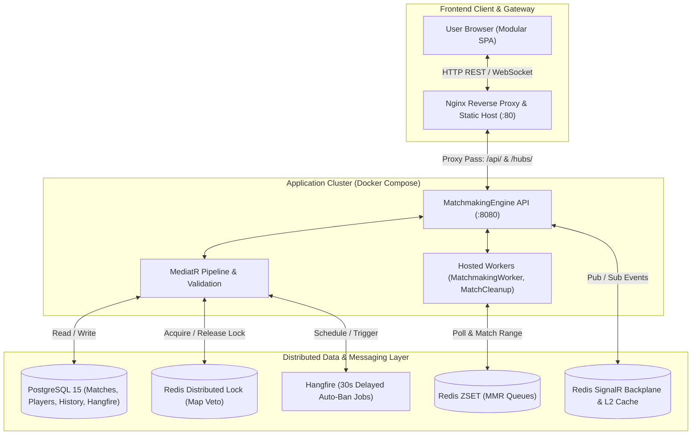

# MatchmakingEngine


A high-performance, horizontally scalable, distributed competitive matchmaking and tournament veto platform inspired by **FACEIT**, **CS2 Premier**, and **Dota 2**. 

Built with **.NET 10** and **ASP.NET Core**, the solution showcases production-grade distributed system patterns: **Redis Distributed Locks** for atomic turn-based operations, **Redis Sorted Sets** with dynamic MMR delta expansion, a **Dual-Level Cache (L1 Memory + L2 Redis)**, **SignalR WebSocket mesh** with a Redis backplane, resilient **Hangfire AFK fallback jobs**, and a modern, high-fps **Modular Single Page Application (SPA)** orchestrated with **Docker Compose**, **Nginx**, and **Fail2ban** on **AWS EC2**.

---

## Architecture Overview

The backend is built following **Clean Architecture** and **Domain-Driven Design (DDD)** principles, separating core domain models, business use-cases, external infrastructure, and presentation layers:

```
MatchmakingEngine/
├── MatchmakingEngine/              # ASP.NET Core API Host (Controllers, SignalR Hubs, Workers, Middleware)
├── MatchmakingEngine.Application/  # CQRS Commands & Queries (MediatR), Pipeline Behaviors, FluentValidation
├── MatchmakingEngine.Domain/       # Domain Entities, Aggregate Roots, Domain Events, Custom Exceptions
├── MatchmakingEngine.Infrastructure/ # EF Core DbContext, Repositories, Redis Lock, ZSET Queue, Hangfire
├── MatchmakingEngine.Tests/        # Unit & Integration Tests (xUnit, Moq, FluentAssertions)
└── MatchmakingClient/              # Modular Vanilla SPA (Nginx Reverse Proxy, Router, State Store, 60fps UI)
```

### High-Level System Architecture



---

## Key Technical Decisions & Engineering Patterns

### 1. Atomic Map Veto via Redis Distributed Locks
During competitive map vetos, captains ban maps in a strict turn-based sequence. In a multi-replica distributed deployment, simultaneous ban requests or fast double-clicks can create race conditions and phantom bans.
- While PostgreSQL provides row-level optimistic concurrency via `[Timestamp]` (`xmin`), relying solely on database concurrency causes high conflict rates and transaction rollbacks under load.
- **Solution:** Implemented `IDistributedLockService` (`RedisDistributedLockService`) utilizing Redis atomic primitives (`LockTakeAsync` / `LockReleaseAsync`) on `lock:veto:{MatchId}`.
- Every ban action acquires an exclusive distributed lock with automatic lease expiration and exponential backoff retry. This guarantees atomic, strictly serialized execution across all API instances before domain logic and database updates occur.

### 2. Dynamic MMR Matchmaking Queue (Redis Sorted Sets)
- Players in the queue are indexed in Redis **Sorted Sets (`ZSET`)** partitioned by region and mode, where the player's MMR serves as the set score.
- The `MatchmakingWorker` runs continuously in the background, alternating between Solo and Duo pools every 2 seconds.
- It selects an anchor player and queries Redis using `ZRANGEBYSCORE` with a **dynamically expanding MMR window**:
  $$\text{MMR Window} = [\text{MMR} - \Delta, \text{MMR} + \Delta]$$
  $\Delta$ starts at $\pm 50$ and grows based on elapsed queue wait time.
- **Trust Factor Validation:** Players are only matched if their Trust Factor difference falls within acceptable safety tolerances, protecting high-reputation players from toxic/suspicious accounts.

### 3. AFK Auto-Ban Engine & Captain Fallback
- When all players accept a match, the match enters the `MapVeto` phase.
- For each turn, `BanMapCommandHandler` schedules a **Hangfire** delayed job set to fire in 30 seconds.
- If the active captain fails to ban in time, `MapVetoTimeoutEventHandler` intercepts the event, selects a random remaining map, and executes the ban.
- **Captain Resilience:** If an original captain disconnects, the system employs an automated fallback (`match.Players.FirstOrDefault(p => p.Team == X)`), ensuring the veto phase never halts or deadlocks.

### 4. Two-Level Read-Through Cache (L1 Memory + L2 Redis)
- High-read endpoints (such as top MMR leaderboards and player profiles) utilize `TwoLevelCacheService`:
  - **L1 (In-Memory Cache):** Near-zero latency in-process lookups.
  - **L2 (Distributed Redis):** Shared across all API replicas, eliminating cache stampedes.
  - **Database (PostgreSQL):** Accessed only when both L1 and L2 miss.
- Domain events (e.g., `PlayerMmrChangedEvent`) publish cache eviction notifications, maintaining high performance without sacrificing data consistency.

### 5. Modular Client Architecture & 60 FPS Engine
The frontend was refactored from a monolithic script into a clean, modern, modular Single Page Application:
- **Componentized Structure:** `state.js` (centralized store and reentrancy locks), `router.js` (hash-based SPA navigation), `signalr-manager.js` (isolated WebSocket communication), and modular feature components (`queue.js`, `veto.js`, `lobby.js`, `leaderboard.js`, `profile.js`, `admin.js`).
- **In-Place DOM Mutation:** Map cards during the veto phase mutate their styles and state in-place instead of destroying and re-rendering via `innerHTML`. This eliminates DOM layout thrashing and input desynchronization.
- **GPU-Accelerated 60 FPS UI:** Removed all performance-heavy full-viewport `backdrop-filter: blur()` effects that caused software rasterization drops (~5 FPS) during multi-window testing on Chromium. Replaced with compositor-only properties (`transform`, `opacity`) and discrete 1s timer steps, delivering a silky-smooth esports-grade interface.

### 6. Production Hardening & Server-Level Security
- **Fail2ban Integration:** Configured on the AWS EC2 production host with a `systemd` backend for SSH port 22 (`bantime = 1h`, `maxretry = 5`), automatically banning brute-force IPs.
- **Nginx Reverse Proxy:** Serves frontend assets with cache-busting headers (`Cache-Control: no-cache, no-store`), proxies `/api/` to the backend cluster, and manages persistent WebSocket connections (`/hubs/`) with zero-buffering.
- **Security Headers:** Injects `X-Frame-Options: SAMEORIGIN`, `X-Content-Type-Options: nosniff`, and `X-XSS-Protection: 1; mode=block`.
- **API Rate Limiting:** Global fixed-window rate limiter enforcing a strict 30 requests/sec per IP threshold at the middleware level.

---

## Technology Stack

| Domain | Technologies |
|---|---|
| **Runtime & Core** | .NET 10, C# 14, ASP.NET Core Web API |
| **Architecture** | Clean Architecture, CQRS (MediatR), Domain-Driven Design (DDD) |
| **Data Persistence** | PostgreSQL 15, Entity Framework Core 10, Npgsql |
| **Distributed Caching & Locks**| Redis 7, StackExchange.Redis, Redis Distributed Locks, Two-Level Cache |
| **Real-Time WebSockets** | ASP.NET Core SignalR with Redis Backplane |
| **Asynchronous Job Scheduling**| Hangfire (PostgreSQL Storage) |
| **Validation & Pipeline** | FluentValidation, MediatR Pipeline Behaviors |
| **Security & Auth** | JWT Bearer Authentication, BCrypt Password Hashing, Rate Limiting Middleware |
| **Client Frontend** | Vanilla JavaScript (ES6+ Modular SPA), HTML5, Tailwind CSS, SVG Graphics |
| **Reverse Proxy & Gateway** | Nginx Alpine (Reverse Proxy, WebSockets, Cache-Busting) |
| **Containerization & Cloud** | Docker, Docker Compose, AWS EC2 (Ubuntu 24.04 LTS), Elastic IP |
| **Security Hardening** | Fail2ban (Host SSH Protection), Nginx Security Headers |
| **CI / CD** | GitHub Actions (.NET Build/Test Runner, Native OpenSSH EC2 Deployment) |
| **Testing** | xUnit, Moq, FluentAssertions, EF Core InMemory |

---

## API Endpoints

### Authentication & Players
| Method | Route | Description |
|---|---|---|
| `POST` | `/api/Auth/login` | Authenticate player and issue JWT token |
| `POST` | `/api/Players/register` | Register new competitive player account |
| `GET` | `/api/Players/{id}` | Retrieve public player profile by ID |
| `GET` | `/api/Players/my/history` | Retrieve authenticated player's recent match history |

### Matchmaking & Veto
| Method | Route | Description |
|---|---|---|
| `POST` | `/api/Matchmaking/join` | Join the competitive matchmaking queue |
| `POST` | `/api/Matchmaking/leave` | Leave the matchmaking queue |
| `GET` | `/api/Matchmaking/status` | Poll current queue or active match status |
| `POST` | `/api/Matchmaking/accept/{matchId}` | Accept a found match within the 30-second window |
| `POST` | `/api/Matchmaking/decline/{matchId}` | Decline a found match (cancels match for all players) |
| `POST` | `/api/Matchmaking/veto/{matchId}/{mapName}`| Ban a map during the veto phase (Distributed Lock protected) |
| `POST` | `/api/Matchmaking/complete/{matchId}` | (Admin) Complete a match, record scoreboard & calculate MMR |

### Social & Party Management
| Method | Route | Description |
|---|---|---|
| `GET` | `/api/Friends` | Get friend list with online statuses |
| `GET` | `/api/Friends/pending` | Get incoming/outgoing friend requests |
| `POST` | `/api/Friends/request/{targetId}` | Send a friend request to another player |
| `POST` | `/api/Friends/accept/{requestId}` | Accept an incoming friend request |
| `DELETE`| `/api/Friends/{friendshipId}` | Remove a friend |
| `POST` | `/api/Party/create` | Create a duo lobby |
| `POST` | `/api/Party/invite/{friendId}` | Invite a friend to your party |
| `POST` | `/api/Party/join/{partyId}` | Accept party invite and join lobby |
| `POST` | `/api/Party/leave` | Leave current party |

### Leaderboard, Administration & Diagnostics
| Method | Route | Description |
|---|---|---|
| `GET` | `/api/Leaderboard` | Fetch global Top 100 MMR leaderboard (Cached) |
| `GET` | `/api/Admin/matches` | (Admin) Get real-time status of all active & past matches |
| `GET` | `/health` | Health probe (PostgreSQL + Redis connectivity) |

---

## SignalR Real-Time Events (Server → Client)

Hub Endpoint: `wss://{host}/hubs/matchmaking`

| Event | Payload | Description |
|---|---|---|
| `MatchFound` | `matchId` | Broadcast to all matched players when a match is formed |
| `MatchAccepted` | - | Emitted when all players have confirmed ready |
| `MatchCanceled` | - | Broadcast if any player declines or fails to accept |
| `MatchReadyForVeto` | `VetoStateDto` | Initialized veto state sent to captains with map pool & turn info |
| `MapVetoUpdated` | `VetoStateDto` | Broadcast immediately after a map is banned (updates cards in-place) |
| `MatchStarting` | `matchId` | Emitted upon completion of the final ban; server begins launch |
| `MatchFinished` | `ResultDto` | Match concluded; broadcasts final scoreboard, K/D, and MMR changes |
| `PartyInviteReceived` | `partyId, senderId` | Real-time party invite alert delivered to invited friend |
| `PlayerJoinedParty` | `playerId` | Broadcast to party members when a new player enters the lobby |
| `AdminMatchesUpdated`| - | Real-time broadcast triggering admin dashboard table refresh |

---

## Local Development Setup

### Prerequisites
- [.NET 10 SDK](https://dotnet.microsoft.com/download/dotnet/10.0)
- [Docker Desktop](https://www.docker.com/products/docker-desktop/)
- Git

### 1. Clone Repository
```bash
git clone https://github.com/xhanjo/MatchmakingEngine.git
cd MatchmakingEngine
```

### 2. Launch Infrastructure with Docker Compose
```bash
docker compose up -d
```
This automatically boots:
- **PostgreSQL 15** on port `5432`
- **Redis 7** on port `6379`
- **API Container (`api1`)** on port `5001`
- **Nginx Frontend** on port `80`

### 3. Run Backend (Standalone / Debugging)
If running the API locally in Visual Studio / JetBrains Rider:
```bash
dotnet run --project MatchmakingEngine/MatchmakingEngine.csproj
```
- EF Core database migrations apply automatically on startup with retry resilience.
- Default administrator credentials: `admin` / `Admin123!`
- Swagger UI available at: `http://localhost:5001/swagger`

### 4. Run Tests
```bash
dotnet test MatchmakingEngine.Tests/MatchmakingEngine.Tests.csproj
```

---

## Production Deployment (AWS EC2)

The application is deployed on an **AWS EC2** instance running **Ubuntu 24.04 LTS**:

- **Continuous Deployment:** Managed by GitHub Actions (`.github/workflows/cd.yml`). When code is pushed to `main`, the workflow validates tests via `.NET CI`, connects to EC2 via native OpenSSH, pulls the latest code, and builds/recreates containers via Docker Compose.
- **Fail2ban SSH Protection:** Configured with a dedicated jail in `/etc/fail2ban/jail.local` monitoring systemd logs on SSH port 22, banning malicious IPs after 5 failed attempts for 1 hour.
- **Nginx Reverse Proxy:** Terminates incoming web traffic on port 80, directs WebSocket traffic cleanly to `/hubs/`, and handles static SPA delivery with optimal caching rules.

---

## License

This project is licensed under the MIT License - see the [LICENSE](LICENSE) file for details.
